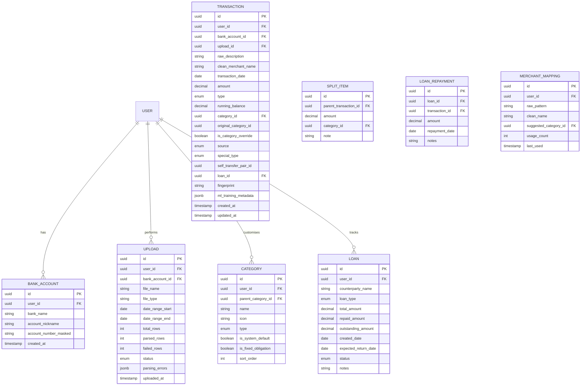
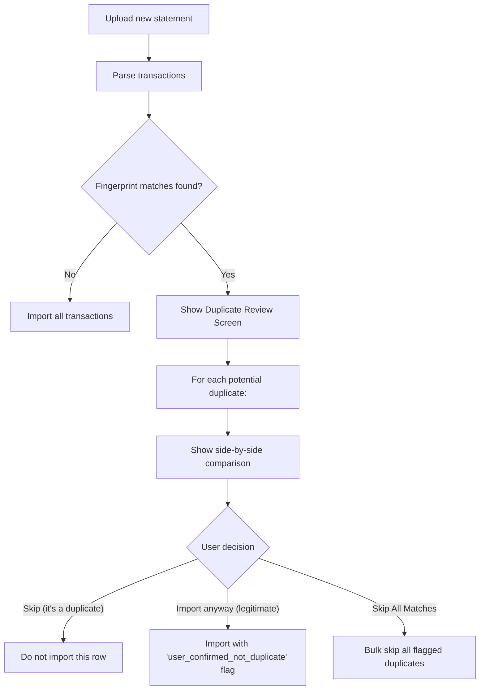
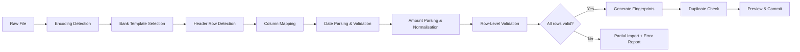
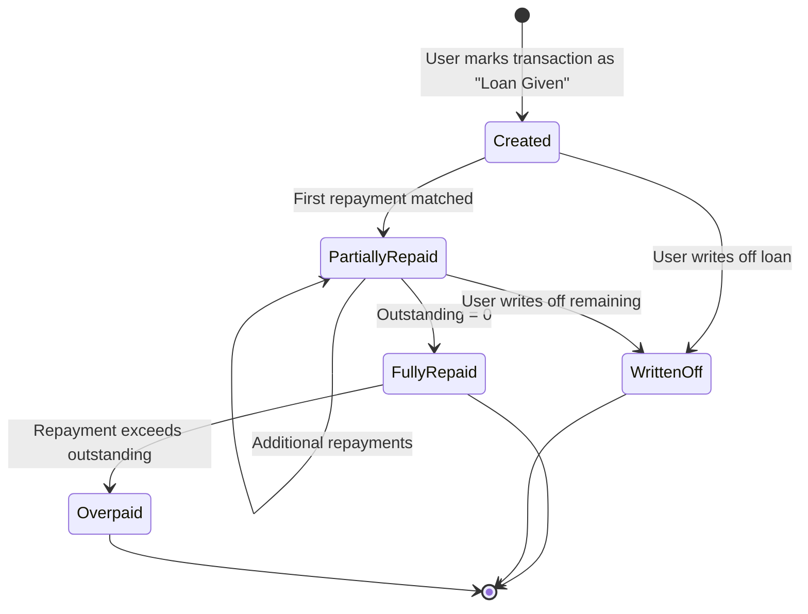

# FinTrack — Personal Finance & Expense-Tracking Platform

> **Document Version:** 1.0  
> **Date:** 2026-05-31  
> **Author:** Product Management  
> **Status:** Draft — Pending Stakeholder Review  

---

# PART I — BUSINESS REQUIREMENTS DOCUMENT (BRD)

---

## 1. Executive Summary

**FinTrack** is a responsive web application that empowers individuals to take complete control of their personal finances. Unlike generic budgeting apps that only scrape bank feeds, FinTrack combines **manual bank statement uploads, cash tracking, investment monitoring, and peer-to-peer loan management** into a single source of truth for a user's financial health.

The platform's differentiation lies in three pillars:

| Pillar | Description |
|---|---|
| **Accuracy** | Multi-bank statement ingestion with duplicate detection, format normalisation, and user-driven categorisation ensures every rupee/dollar is accounted for exactly once. |
| **Completeness** | Tracking cash income, SIPs, PF, NPS, and peer-to-peer loans closes the visibility gap that bank-only apps leave open. |
| **Intelligence (Future)** | A purpose-built data architecture captures raw transaction strings, clean merchant names, and user overrides to train ML models for auto-categorisation in future releases. |

The MVP targets **salaried professionals in India** aged 22-40 who manage 2-4 bank accounts, invest in mutual funds/PF/NPS, and frequently transact in cash.

---

## 2. Business Objectives

| # | Objective | KPI | Target (6 Months Post-Launch) |
|---|---|---|---|
| O1 | Enable users to classify 100% of their financial transactions | % of uncategorised transactions per user | < 5% |
| O2 | Deliver an accurate monthly budget snapshot | User-reported accuracy satisfaction (survey) | ≥ 4.2 / 5 |
| O3 | Reduce time spent on financial tracking | Average session time for monthly reconciliation | < 15 minutes |
| O4 | Build an ML-ready transaction dataset | Volume of labelled transactions stored | ≥ 500,000 rows |
| O5 | Achieve product-market fit | Monthly Active Users (MAU) | ≥ 5,000 |
| O6 | Drive organic growth through word-of-mouth | Net Promoter Score (NPS) | ≥ 50 |

---

## 3. Target Audience

### 3.1 Primary Persona — "Organised Arun"

| Attribute | Detail |
|---|---|
| **Age** | 26-35 |
| **Occupation** | Salaried IT professional |
| **Bank Accounts** | 2-3 (Salary account + savings + occasional trading account) |
| **Investment Profile** | SIP in 2-3 mutual funds, EPF via employer, started NPS |
| **Pain Point** | Spends 45+ minutes monthly in spreadsheets trying to reconcile expenses across banks. Loses track of cash expenses. Can't tell if money sent to a friend is a loan or a gift. |
| **Tech Savviness** | High — comfortable uploading files, expects modern UI |

### 3.2 Secondary Persona — "Budgeting Priya"

| Attribute | Detail |
|---|---|
| **Age** | 22-28 |
| **Occupation** | Early-career professional or freelancer |
| **Bank Accounts** | 1-2 |
| **Investment Profile** | Just starting — 1 SIP, no NPS/PF yet |
| **Pain Point** | Doesn't know where her money goes each month. Cash spending is a black hole. Wants simple insights, not complex spreadsheets. |
| **Tech Savviness** | Medium — prefers mobile, dislikes complex forms |

### 3.3 Anti-Persona (Out of Scope for MVP)

- **High-net-worth individuals** with brokerage accounts, real estate portfolios, and tax optimisation needs.
- **Business owners** requiring invoicing, GST tracking, or multi-user accounting.
- **Users requiring real-time bank API integration** (e.g., Account Aggregator / Open Banking) — this is a future roadmap item.

---

## 4. Value Proposition

> *"FinTrack is the only personal finance app that treats your money as a complete picture — bank accounts, cash, investments, and loans — so you always know your true monthly budget, not just what your bank statement says."*

### 4.1 Value Proposition Canvas

| Customer Job | Pain | FinTrack Gain |
|---|---|---|
| Know my true monthly spending | Bank statements miss cash; investment outflows look like expenses | Separate tracking for cash, investments (SIP/PF/NPS), and true expenses |
| Categorise transactions quickly | Manually tagging hundreds of rows in Excel is tedious | Smart defaults + bulk actions + keyboard shortcuts + future ML auto-suggest |
| Track money lent to friends | Loans to friends inflate "expenses"; repayments inflate "income" | Dedicated P2P Loan ledger with partial repayment tracking |
| Avoid double-counting | Uploading overlapping date ranges creates duplicates | Automated duplicate detection with user confirmation |
| Reconcile across banks | Self-transfers between own accounts appear as both expense and income | Self-transfer matching across banks |

---

## 5. Scope

### 5.1 In Scope (MVP — Phase 1)

- Manual bank statement upload (CSV/Excel) with bank-specific parsing
- Transaction categorisation with default + custom categories
- Income tracking (bank + cash)
- Investment tracking (SIP, PF, NPS) as asset flows
- Self-transfer marking (single bank and multi-bank)
- P2P loan tracking with partial repayments
- Split transactions
- Duplicate detection
- Manual cash entry
- Monthly budget dashboard
- ML training data capture (passive — data collection only)
- Responsive web app (mobile-first)

### 5.2 Out of Scope (Future Phases)

| Feature | Target Phase |
|---|---|
| Real-time bank API integration (Account Aggregator) | Phase 2 |
| ML-powered auto-categorisation | Phase 2 |
| Bill reminders and recurring expense detection | Phase 2 |
| Goal-based savings tracking | Phase 3 |
| Multi-currency support | Phase 3 |
| Shared household budgets | Phase 3 |
| Tax computation and filing assistance | Phase 4 |
| Mobile native apps (iOS/Android) | Phase 4 |

---

## 6. Assumptions & Constraints

### 6.1 Assumptions

1. Users are willing to manually upload bank statements in CSV/Excel format.
2. Users will categorise their transactions if the UX makes it fast and frictionless.
3. Indian banks provide downloadable statements in reasonably parseable formats.
4. Users have at most 5 bank accounts to track in the MVP.
5. The average user has 100-400 transactions per month across all accounts.

### 6.2 Constraints

1. **No direct bank API access** — MVP relies entirely on manual uploads.
2. **Single-user system** — no shared accounts or multi-user collaboration in Phase 1.
3. **No financial advice** — the platform is a tracking tool, not a robo-advisor.
4. **Data privacy** — all financial data must be encrypted at rest and in transit. No data is shared with third parties.

---

## 7. Success Metrics

| Metric | Measurement Method | Success Threshold |
|---|---|---|
| **Activation Rate** | % of sign-ups who upload ≥ 1 statement within 7 days | ≥ 60% |
| **Categorisation Completion** | % of transactions categorised per active user per month | ≥ 95% |
| **Retention (M1)** | % of users active in month 2 after sign-up | ≥ 40% |
| **Session Efficiency** | Median time to categorise a full month's transactions | < 15 min |
| **Error Rate** | % of uploads that fail due to parsing errors | < 5% |
| **Mobile Usage** | % of sessions from mobile devices | ≥ 50% |

---

## 8. Risk Assessment

| Risk | Likelihood | Impact | Mitigation |
|---|---|---|---|
| Users find manual upload too tedious | Medium | High | Phase 2 bank API integration; minimize upload friction with drag-and-drop + smart parsing |
| Bank statement formats change without notice | High | Medium | Abstract parsing rules into configurable templates; admin panel for quick updates |
| Duplicate detection produces false positives | Medium | Medium | Always require user confirmation before merging; provide "undo" capability |
| Users abandon categorisation halfway | Medium | High | Implement bulk categorisation, keyboard shortcuts, and "suggested similar" grouping |
| Data privacy breach | Low | Critical | Encrypt all data at rest (AES-256) and in transit (TLS 1.3); regular security audits |

---
---

# PART II — PRODUCT REQUIREMENTS DOCUMENT (PRD)

---

## 1. Product Overview

### 1.1 Product Name
**FinTrack**

### 1.2 Product Summary
FinTrack is a mobile-first responsive web application that serves as a unified personal finance dashboard. Users upload bank statements, manually log cash transactions, track investments, manage peer-to-peer loans, and view categorised spending reports — all within a single platform designed for speed and clarity.

### 1.3 Information Architecture

```mermaid
graph TD
    A["FinTrack App"] --> B["Dashboard"]
    A --> C["Transactions"]
    A --> D["Upload Centre"]
    A --> E["Accounts & Banks"]
    A --> F["Loans (P2P)"]
    A --> G["Investments"]
    A --> H["Cash Ledger"]
    A --> I["Reports & Insights"]
    A --> J["Settings"]
    
    C --> C1["All Transactions"]
    C --> C2["Uncategorised"]
    C --> C3["Self-Transfers"]
    C --> C4["Split Transactions"]
    
    D --> D1["Upload Statement"]
    D --> D2["Upload History"]
    D --> D3["Parsing Status"]
    
    F --> F1["Active Loans"]
    F --> F2["Loan History"]
    F --> F3["Repayment Tracker"]
    
    G --> G1["SIP Tracker"]
    G --> G2["PF Summary"]
    G --> G3["NPS Summary"]
    
    I --> I1["Monthly Budget"]
    I --> I2["Category Breakdown"]
    I --> I3["Trends (3/6/12 mo)"]
    I --> I4["Income vs Expense"]
```



---

## 2. User Stories

### 2.1 Module: Data Ingestion (Bank Statements)

| ID | User Story | Priority | Acceptance Criteria |
|---|---|---|---|
| US-101 | As a **user**, I want to **select my bank from a dropdown before uploading a statement**, so that **the system applies the correct parsing rules for that bank's format**. | P0 | Dropdown shows all supported banks alphabetically. Selection is mandatory before upload button is enabled. |
| US-102 | As a **user**, I want to **upload my bank statement in CSV or Excel (.xls/.xlsx) format**, so that **my transactions are automatically extracted and displayed**. | P0 | System accepts .csv, .xls, .xlsx files up to 10 MB. Parsing completes within 30 seconds. Parsed transactions appear in a review table. |
| US-103 | As a **user**, I want to **see a preview of parsed transactions before they are committed**, so that **I can verify the data looks correct and fix issues before saving**. | P0 | Preview table shows: Date, Description, Amount, Type (Credit/Debit), Running Balance (if available). User can edit individual fields. "Confirm & Import" button commits data. |
| US-104 | As a **user**, I want to **upload statements at any frequency (weekly, monthly, or ad-hoc)**, so that **I'm not locked into a rigid schedule**. | P1 | No restrictions on upload frequency. System handles overlapping date ranges gracefully (see Edge Case EC-01). |
| US-105 | As a **user**, I want to **see my upload history with status indicators**, so that **I know which statements have been processed successfully**. | P1 | Upload history table shows: File name, Bank, Upload date, Date range covered, Row count, Status (Success / Partial / Failed), Actions (View / Delete). |
| US-106 | As a **user**, I want to **receive clear error messages when a file fails to parse**, so that **I understand what went wrong and can fix it**. | P0 | Error messages specify: line number, column, expected format vs. actual value. Partial parses are allowed — successfully parsed rows are imported; failed rows are listed for manual review. |

---

### 2.2 Module: Transaction Classification Engine

| ID | User Story | Priority | Acceptance Criteria |
|---|---|---|---|
| US-201 | As a **user**, I want to **categorise each transaction using a default set of categories**, so that **I can quickly organise my spending without setup**. | P0 | Default categories provided (see §3.2). Category selector is a searchable dropdown with icons. |
| US-202 | As a **user**, I want to **create custom sub-categories under any default category**, so that **I can track spending at a granularity that matters to me**. | P0 | User can add sub-categories via Settings > Categories. Sub-categories appear nested under parent in the selector. Max depth: 2 levels (Category > Sub-category). |
| US-203 | As a **user**, I want to **bulk-categorise multiple transactions at once**, so that **I don't have to tag hundreds of transactions one by one**. | P0 | Multi-select (checkbox) on transaction list. Bulk action bar appears with "Set Category" option. Applies to all selected transactions. |
| US-204 | As a **user**, I want to **see "suggested similar" transactions when I categorise one**, so that **I can quickly apply the same category to matching transactions**. | P1 | After categorising a transaction, system shows a toast/banner: "X similar transactions found — Apply same category?" Similar = same merchant/description substring match. |
| US-205 | As a **user**, I want to **use keyboard shortcuts to rapidly categorise transactions**, so that **power users can fly through the categorisation flow**. | P1 | Keyboard shortcuts: `↑`/`↓` to navigate transactions, `Enter` to open category picker, type to search, `Enter` to confirm, `Tab` to move to next uncategorised. Shortcut reference accessible via `?` key. |
| US-206 | As a **user**, I want to **filter the transaction list by "Uncategorised" status**, so that **I can focus only on transactions that need my attention**. | P0 | Filter chip/toggle: "Show Uncategorised Only". Badge shows count of uncategorised transactions. |
| US-207 | As a **user**, I want the system to **remember my categorisation choices for similar future transactions**, so that **repeat merchants are pre-categorised over time**. | P1 | System stores mappings: `{merchant_pattern → category}`. On new imports, matching transactions are auto-suggested (not auto-committed). User confirms or overrides. |

---

### 2.3 Module: Omni-Channel Financial Tracking

| ID | User Story | Priority | Acceptance Criteria |
|---|---|---|---|
| US-301 | As a **user**, I want to **track my salary and other bank deposits as income**, so that **I can see my total earnings each month**. | P0 | Transactions categorised as "Income" are summed in the dashboard Income widget. Supports multiple income sources. |
| US-302 | As a **user**, I want to **manually add cash income entries (e.g., freelance payment, gift)**, so that **my income picture includes non-bank sources**. | P0 | Manual entry form: Amount, Date, Source/Description, Category (defaults to "Cash Income"). Entries appear in the transaction list with a "Cash" badge. |
| US-303 | As a **user**, I want to **mark outflows to Mutual Fund SIPs as "Investments" not "Expenses"**, so that **my monthly spending calculation reflects only true expenses**. | P0 | Category "Investments > Mutual Fund SIP" is a default category. Transactions in this category are excluded from "Total Expenses" and included in "Total Investments" on the dashboard. |
| US-304 | As a **user**, I want to **track PF and NPS contributions separately**, so that **I can see my total retirement savings alongside my regular investments**. | P0 | Default categories: "Investments > Provident Fund", "Investments > NPS". Dashboard shows a dedicated "Retirement Savings" card. |
| US-305 | As a **user**, I want to **see a unified view of Income, Expenses, Investments, and Net Savings**, so that **I understand my complete financial picture at a glance**. | P0 | Dashboard formula: `Net Savings = Income - Expenses - Investments`. All four values displayed prominently. Self-transfers and P2P loans are excluded from this calculation. |

---

### 2.4 Module: Complex Transaction Handling

| ID | User Story | Priority | Acceptance Criteria |
|---|---|---|---|
| US-401 | As a **user**, I want to **mark a transaction as a "Self-Transfer"**, so that **transfers between my own accounts don't inflate my expenses or income**. | P0 | "Self-Transfer" action available on any transaction. Marking as self-transfer removes it from Income and Expense calculations. Paired transactions (if both banks uploaded) are linked visually. |
| US-402 | As a **user**, I want the system to **suggest potential self-transfer matches across my banks**, so that **I don't have to manually find matching pairs**. | P1 | When a transaction is marked as self-transfer, system searches for a matching counter-transaction (same amount, within ±3 days, opposite type) across other bank accounts. Shows candidates for user confirmation. |
| US-403 | As a **user**, I want to **record money lent to a friend as a "Loan Given"**, so that **it doesn't count as an expense**. | P0 | "Loan Given" action on any debit transaction. Prompts for: Borrower Name, Expected Return Date (optional), Notes. Creates a Loan record. Transaction excluded from Expenses. |
| US-404 | As a **user**, I want to **record a repayment received against a specific loan**, so that **the loan balance is updated and the repayment doesn't count as income**. | P0 | On any credit transaction, action "Match to Loan Repayment" → shows list of open loans → user selects one → repayment amount is deducted from loan balance. Transaction excluded from Income. |
| US-405 | As a **user**, I want to **split a single transaction into multiple categories**, so that **a mixed-purpose withdrawal is accurately classified**. | P0 | "Split Transaction" action available on any transaction. User specifies N splits: each with Amount + Category. Sum of splits must equal original transaction amount. Split items appear as sub-rows under the parent transaction. |
| US-406 | As a **user**, I want to **view all my active loans in a dedicated Loans dashboard**, so that **I can track who owes me what and follow up**. | P1 | Loans page shows: Borrower Name, Total Lent, Total Repaid, Outstanding Balance, Last Activity Date, Status (Open/Closed). Filters: All / Open / Closed. |
| US-407 | As a **user**, I want to **record money borrowed from a friend as a "Loan Taken"**, so that **it doesn't count as income and I can track my obligation**. | P1 | Mirrors US-403 but for credit transactions. Creates a Loan record where the user is the borrower. |

---

### 2.5 Module: Manual Cash Entry

| ID | User Story | Priority | Acceptance Criteria |
|---|---|---|---|
| US-501 | As a **user**, I want to **quickly log a cash expense with minimal taps**, so that **I can capture spending on the go without friction**. | P0 | Quick-entry form: Amount (numeric keypad), Category (recent categories shown first), Date (defaults to today), Note (optional). Max 3 taps to log. Accessible via floating "+" button on mobile. |
| US-502 | As a **user**, I want to **see cash entries mixed into my main transaction list**, so that **I have one unified timeline of all spending**. | P0 | Cash entries appear in the transaction list with a "💵 Cash" badge. Sortable and filterable alongside bank transactions. |
| US-503 | As a **user**, I want to **edit or delete a cash entry I made by mistake**, so that **my records stay accurate**. | P0 | Swipe-to-delete on mobile, right-click context menu on desktop. Edit opens the entry form pre-filled. |

---

### 2.6 Module: Reports & Insights Dashboard

| ID | User Story | Priority | Acceptance Criteria |
|---|---|---|---|
| US-601 | As a **user**, I want to **see a monthly summary showing Income, Expenses, Investments, and Net Savings**, so that **I know my financial position each month**. | P0 | Dashboard cards: Total Income, Total Expenses, Total Investments, Net Savings. Month selector at top. Comparison badges vs. previous month (e.g., "↑ 12% from last month"). |
| US-602 | As a **user**, I want to **see a category-wise pie/donut chart of my expenses**, so that **I can visually identify where most of my money goes**. | P0 | Interactive donut chart. Click a segment to drill into sub-categories. Hover to see amount + percentage. |
| US-603 | As a **user**, I want to **view spending trends over 3, 6, or 12 months**, so that **I can identify patterns and make better decisions**. | P1 | Line chart showing monthly totals for selected categories. Toggle between categories. Time range selector: 3M / 6M / 12M / Custom. |
| US-604 | As a **user**, I want to **see my "true budget" — defined as Income minus fixed obligations (EMIs, rent, SIPs, PF, NPS)**, so that **I know my discretionary spending power**. | P1 | Dashboard card: "Discretionary Budget". Formula: `Income - Rent - EMIs - SIPs - PF - NPS`. User tags specific categories as "Fixed Obligations" in Settings. |

---

## 3. Functional Specifications

### 3.1 Supported Bank Formats (MVP)

The system must support bank-specific parsing templates for the following banks at launch. Each template defines:

- **Column mapping** (which columns contain Date, Description, Debit, Credit, Balance)
- **Date format** (DD/MM/YYYY, MM/DD/YYYY, YYYY-MM-DD, DD-Mon-YY, etc.)
- **Amount convention** (separate Debit/Credit columns vs. single Amount column with +/- signs)
- **Header row detection** (fixed row number or keyword-based)
- **Skip rows** (number of metadata rows before the actual data)

| Bank | Format | Date Format | Amount Convention | Notes |
|---|---|---|---|---|
| HDFC Bank | CSV/Excel | DD/MM/YY | Separate Debit/Credit | Extra metadata rows at top |
| ICICI Bank | Excel | DD-Mon-YYYY | Separate Debit/Credit | Multiple sheets possible |
| SBI | CSV | DD/MM/YYYY | Single column with CR/DR suffix | Inconsistent spacing |
| Axis Bank | Excel | DD-MM-YYYY | Separate columns | Standard |
| Kotak Mahindra | CSV | MM/DD/YYYY | Signed amount (negative = debit) | US-style date format |
| Yes Bank | Excel | DD/MM/YYYY | Separate Debit/Credit | Standard |
| IDFC First | CSV | YYYY-MM-DD | Separate columns | ISO date format |
| Bank of Baroda | Excel | DD-Mon-YY | Single column with sign | Abbreviated month |
| Generic/Other | CSV | User-selected | User-mapped columns | Fallback for unsupported banks |

> [!IMPORTANT]
> The "Generic/Other" option must provide a **column mapping wizard** where the user manually maps columns from their file to the required fields (Date, Description, Amount/Debit/Credit, Balance). This is critical for handling unsupported banks.

### 3.2 Default Category Taxonomy

```
├── 🏠 Housing
│   ├── Rent
│   ├── Maintenance / Society Charges
│   ├── Home Loan EMI
│   └── Repairs & Furnishing
│
├── 🍔 Food & Dining
│   ├── Groceries
│   ├── Restaurants & Eating Out
│   ├── Food Delivery (Swiggy/Zomato)
│   └── Coffee & Snacks
│
├── 🚗 Transportation
│   ├── Fuel
│   ├── Public Transport
│   ├── Ride Hailing (Uber/Ola)
│   ├── Vehicle EMI
│   └── Vehicle Maintenance
│
├── 🛍️ Shopping
│   ├── Clothing & Accessories
│   ├── Electronics & Gadgets
│   ├── Home & Kitchen
│   └── Personal Care
│
├── 💡 Utilities
│   ├── Electricity
│   ├── Water
│   ├── Gas (Piped/Cylinder)
│   ├── Internet & Broadband
│   └── Mobile Recharge
│
├── 🎓 Education
│   ├── Tuition & Fees
│   ├── Books & Courses
│   └── Coaching / Certifications
│
├── 🏥 Health & Wellness
│   ├── Medical / Doctor
│   ├── Pharmacy
│   ├── Gym & Fitness
│   └── Health Insurance Premium
│
├── 🎭 Entertainment
│   ├── Movies & OTT Subscriptions
│   ├── Gaming
│   ├── Travel & Holidays
│   └── Hobbies
│
├── 💰 Investments (excluded from Expenses)
│   ├── Mutual Fund SIP
│   ├── Provident Fund (PF)
│   ├── National Pension Scheme (NPS)
│   ├── Fixed Deposit
│   ├── Stocks / Equity
│   └── Gold / Sovereign Gold Bond
│
├── 💳 Financial Obligations
│   ├── Credit Card Bill Payment
│   ├── Personal Loan EMI
│   ├── Insurance Premium (Life/Term)
│   └── Tax Payments
│
├── 🤝 Loans (P2P) (excluded from Expenses/Income)
│   ├── Loan Given
│   └── Loan Repayment Received
│
├── 🔄 Self-Transfer (excluded from Expenses/Income)
│
├── 💵 Income
│   ├── Salary
│   ├── Freelance / Side Income
│   ├── Interest / Dividends
│   ├── Cashback / Rewards
│   ├── Gift Received
│   └── Refund
│
└── ❓ Uncategorised
```

### 3.3 Data Model (Logical)



### 3.4 Transaction Fingerprinting Algorithm

To detect duplicates, each transaction is assigned a **fingerprint** — a hash of its identifying attributes:

```
fingerprint = SHA-256(
    bank_account_id +
    transaction_date +
    amount +
    type (debit/credit) +
    normalise(raw_description)
)
```

Where `normalise()`:
1. Converts to lowercase
2. Removes extra whitespace
3. Removes special characters except alphanumeric and spaces
4. Trims to first 100 characters

> [!NOTE]
> The fingerprint is **not** a guarantee of uniqueness — legitimate duplicate transactions (e.g., two identical ₹500 Swiggy orders on the same day) will have the same fingerprint. The system uses fingerprints to **flag potential duplicates** for user review, not to auto-delete.

---

## 4. Edge Case Specifications

### EC-01: Duplicate Transactions from Overlapping Uploads

**Scenario:** A user uploads their March 2026 statement (March 1-31), then later uploads a quarterly statement (Jan 1 - March 31) for the same bank account.

**Detection Logic:**
1. On import, compute fingerprints for all incoming transactions.
2. Compare against existing fingerprints for the same `bank_account_id`.
3. If matches are found, flag them as **"Potential Duplicates"**.

**User Flow:**


**UI Requirements:**
- Duplicate review screen shows a split view: existing transaction on left, new transaction on right.
- Highlight matching fields in green, differing fields in amber.
- "Skip All Duplicates" bulk action button for users who trust the detection.
- Count badge: "23 potential duplicates found in this upload."

---

### EC-02: Split Transactions

**Scenario:** A user withdraws ₹10,000 from an ATM. They spent ₹5,000 on groceries, ₹3,000 was lent to a friend, and ₹2,000 was for personal shopping.

**User Flow:**
1. User selects the ₹10,000 ATM withdrawal transaction.
2. Clicks "Split Transaction" action.
3. A modal appears with the original amount displayed at the top.
4. User adds split rows:
   - Row 1: ₹5,000 → Groceries
   - Row 2: ₹3,000 → Loan Given → (triggers Loan creation flow from US-403)
   - Row 3: ₹2,000 → Shopping > Personal Care
5. A running total shows: `₹5,000 + ₹3,000 + ₹2,000 = ₹10,000 ✓`
6. If the sum ≠ original amount, the "Confirm Split" button is disabled with a warning.

**Data Model Impact:**
- Parent transaction's `special_type` is set to `SPLIT`.
- Parent transaction is excluded from category-level reporting.
- `SPLIT_ITEM` rows are created, each with their own `category_id`.
- Reporting aggregates use `SPLIT_ITEM` amounts, not the parent.

**Constraints:**
- Minimum 2 splits required.
- Maximum 10 splits per transaction.
- Each split amount must be > 0.
- Split can be removed/edited later (parent transaction is restored if all splits are deleted).

---

### EC-03: Format Discrepancies Across Banks

**Scenario:** Different banks use different date formats, amount representations, and file structures.

**Handling Strategy:**

| Discrepancy | Solution |
|---|---|
| **Date formats** (DD/MM vs MM/DD) | Each bank template defines the expected date format. For the "Generic" bank option, user selects date format from a dropdown during the column mapping step. System validates all dates against the selected format. |
| **Amount signs** (negative = debit vs positive = debit) | Bank template defines the sign convention. Generic option asks: "In your file, are debits shown as negative numbers?" |
| **Separate vs single amount column** | Bank template defines whether to look for two columns (Debit/Credit) or one (Amount). Generic option auto-detects: if two numeric columns exist, offers both mapping options. |
| **Header row position** | Bank template specifies either a fixed row number or a header detection keyword (e.g., "Date", "Transaction"). Generic option shows first 10 rows and asks user to click the header row. |
| **Extra metadata rows** | Bank template specifies N rows to skip at top and bottom. Generic option handled by header row selection. |
| **Encoding issues** (UTF-8, Latin-1, etc.) | System attempts auto-detection. Falls back to UTF-8. If garbled text detected, shows a warning with encoding selector. |
| **Number formatting** (1,000.00 vs 1.000,00) | Bank template defines locale. Generic option: "How are numbers formatted in your file?" with examples. |

**Validation Pipeline:**



---

### EC-04: Multi-Bank Self-Transfers

**Scenario:** A user transfers ₹50,000 from HDFC Bank to ICICI Bank. When both statements are uploaded:
- HDFC shows: `2026-03-15 | NEFT TO ICICI | -₹50,000`
- ICICI shows: `2026-03-16 | NEFT FROM HDFC | +₹50,000`

**Detection & Matching:**

1. **Manual Trigger:** User marks the HDFC debit as "Self-Transfer." System searches across all bank accounts for:
   - Same amount (absolute value)
   - Opposite type (credit vs debit)
   - Date within ±3 business days
   - Different bank account

2. **Candidate Presentation:**
   - System shows matching candidates ranked by date proximity.
   - Each candidate shows: Bank, Date, Description, Amount.
   - User clicks to confirm the match.

3. **Post-Match:**
   - Both transactions are linked via `self_transfer_pair_id`.
   - Both are excluded from Income and Expense calculations.
   - Visual indicator (🔗 icon) on both transactions in the list.

4. **No Match Found:**
   - If no matching transaction exists (other bank not yet uploaded), the marked transaction is stored as an **"Unmatched Self-Transfer"**.
   - When the other bank's statement is later uploaded, the system re-runs matching for all unmatched self-transfers and prompts the user.

---

### EC-05: Partial Loan Repayments

**Scenario:** User lends ₹30,000 to a friend "Rahul." Rahul pays back in three installments: ₹10,000, ₹12,000, and ₹8,000 over two months.

**Loan Lifecycle:**



**Detailed Flow:**

| Step | Action | Loan Balance | Transaction Treatment |
|---|---|---|---|
| 1 | User marks ₹30,000 debit as "Loan Given to Rahul" | Outstanding: ₹30,000 | Excluded from Expenses |
| 2 | ₹10,000 credit received → User matches to Rahul's loan | Outstanding: ₹20,000 | Excluded from Income |
| 3 | ₹12,000 credit received → User matches to Rahul's loan | Outstanding: ₹8,000 | Excluded from Income |
| 4 | ₹8,000 credit received → User matches to Rahul's loan | Outstanding: ₹0 (Auto-closed) | Excluded from Income |

**Edge Cases within P2P Loans:**

| Scenario | Handling |
|---|---|
| **Overpayment:** Rahul pays ₹35,000 against ₹30,000 loan | System warns: "Repayment exceeds outstanding balance by ₹5,000." User chooses: (a) Accept overpayment — excess is tagged as Income, or (b) Create a new "Loan Taken" from Rahul for ₹5,000. |
| **Multiple loans to same person:** Two separate loans to Rahul | Loan ledger shows separate entries. When matching repayment, user selects which loan to apply it to. |
| **Partial match:** Repayment amount doesn't match any loan exactly | User manually selects the loan and the full credit amount is applied as a partial repayment. |
| **Write-off:** Rahul won't pay back | User can "Write Off" the outstanding balance. Written-off amount is re-categorised as an Expense under "Loans > Written Off." |
| **Loan Taken (user borrows):** | Mirrors the above but with reversed credit/debit treatment. |

---

### EC-06: Manual Cash Entries

**Scenario:** A user wants to log daily cash expenses without a bank statement.

**Frictionless Entry Design (Mobile-First):**

```
┌─────────────────────────────┐
│  ₹ [        ] ← Big numeric │
│     Amount input             │
├─────────────────────────────┤
│  📁 Category                │
│  ┌─────┐ ┌─────┐ ┌───────┐ │
│  │Food │ │Trans│ │Grocer.│ │ ← Recent categories
│  └─────┘ └─────┘ └───────┘ │
│  ┌─────┐ ┌─────┐ ┌───────┐ │
│  │Shop │ │Utils│ │ More… │ │
│  └─────┘ └─────┘ └───────┘ │
├─────────────────────────────┤
│  📅 Today        🔽 Change  │
├─────────────────────────────┤
│  📝 Add note (optional)     │
├─────────────────────────────┤
│  [ + Add Cash Expense ]     │ ← Primary CTA
└─────────────────────────────┘
```

**Key UX Decisions:**

1. **Amount-first design:** The numeric keypad / amount field is the first and largest element.
2. **Recent categories:** Show the user's 6 most-used categories as quick-tap chips.
3. **Date defaults to today:** Only show the date picker if the user taps "Change."
4. **Note is optional and collapsed:** Don't force the user to describe every ₹20 chai.
5. **Floating Action Button (FAB):** A persistent "+" button on the mobile transaction list opens this quick-entry form as a bottom sheet.
6. **Haptic feedback:** On mobile, provide haptic feedback on successful save.
7. **Streak/Gamification (P2):** Future — "You've logged cash expenses 7 days in a row! 🔥"

---

## 5. ML Training Data Architecture

### 5.1 Design Philosophy

Every user interaction with the categorisation engine is a potential ML training signal. The system must passively capture this data without adding friction to the user experience.

### 5.2 Data Points Captured per Transaction

| Field | Source | Purpose |
|---|---|---|
| `raw_description` | Bank statement | Original merchant/description string as-is |
| `clean_merchant_name` | User input (or system suggestion confirmed by user) | Standardised merchant name for grouping |
| `category_id` | User selection | The final category assigned |
| `original_category_id` | System suggestion (if any) | What the system initially suggested (null for manual) |
| `is_category_override` | Computed | `true` if user changed the system's suggestion |
| `ml_training_metadata` | System-generated JSON | Additional context (see below) |

### 5.3 `ml_training_metadata` Schema

```json
{
  "suggestion_source": "merchant_mapping | rule_based | ml_model_v1 | none",
  "suggestion_confidence": 0.87,
  "time_to_categorise_ms": 3200,
  "was_bulk_categorised": false,
  "was_split": false,
  "user_searched_category": true,
  "search_query": "groc",
  "device_type": "mobile",
  "session_position": 15,
  "total_uncategorised_in_session": 47
}
```

### 5.4 Merchant Mapping Table

The `MERCHANT_MAPPING` table serves dual purposes:
1. **User-facing:** Powers "suggested similar" functionality (US-204, US-207).
2. **ML training:** Provides a clean merchant-to-category mapping dataset.

| Column | Purpose |
|---|---|
| `raw_pattern` | Regex-like pattern derived from `raw_description` (e.g., `SWIGGY*` matches `SWIGGY ORDER #123`, `SWIGGY DELIVERY`) |
| `clean_name` | User-defined or confirmed clean name (e.g., "Swiggy") |
| `suggested_category_id` | Category to suggest for future matches |
| `usage_count` | How many times this mapping has been used — higher = more confident |

---

## 6. Non-Functional Requirements

### 6.1 Performance

| Metric | Requirement |
|---|---|
| File parsing (500 rows) | < 5 seconds |
| File parsing (5,000 rows) | < 30 seconds |
| Transaction list load (1,000 rows) | < 2 seconds (initial), < 500ms (paginated) |
| Dashboard load | < 3 seconds |
| Quick cash entry save | < 1 second |
| Search across transactions | < 2 seconds for 10,000 rows |

### 6.2 Scalability

| Dimension | MVP Target | Design-For |
|---|---|---|
| Users | 5,000 MAU | 50,000 MAU |
| Transactions per user | 5,000 / year | 50,000 / year |
| Bank accounts per user | 5 | 10 |
| File size | 10 MB | 50 MB |
| Concurrent uploads | 10 | 100 |

### 6.3 Security & Privacy

| Requirement | Specification |
|---|---|
| Data encryption at rest | AES-256 |
| Data encryption in transit | TLS 1.3 |
| Authentication | Email/password + OAuth (Google) |
| Session management | JWT with 24-hour expiry, refresh tokens |
| Password policy | Min 8 chars, 1 uppercase, 1 number, 1 special char |
| File storage | Uploaded files stored encrypted; auto-deleted after 30 days post-processing |
| PII handling | Account numbers masked (show last 4 digits only). No full account numbers stored. |
| Data export | User can export all their data in JSON/CSV format (GDPR-style) |
| Account deletion | Hard delete all user data within 30 days of request |

### 6.4 Accessibility

| Requirement | Standard |
|---|---|
| WCAG compliance | Level AA |
| Screen reader support | All interactive elements have ARIA labels |
| Keyboard navigation | Full app navigable via keyboard |
| Color contrast | Minimum 4.5:1 ratio for text |
| Touch targets | Minimum 44x44px on mobile |
| Font sizing | Base 16px, scalable up to 200% without loss of functionality |

### 6.5 Responsive Design Breakpoints

| Breakpoint | Target | Layout |
|---|---|---|
| < 480px | Mobile (portrait) | Single column, bottom navigation, bottom sheet modals |
| 480px – 768px | Mobile (landscape) / Small tablet | Single column, expanded cards |
| 768px – 1024px | Tablet | Two-column layout, side navigation |
| 1024px – 1440px | Desktop | Three-column layout, full sidebar |
| > 1440px | Large desktop | Max-width container (1440px), centered |

### 6.6 Browser Support

| Browser | Minimum Version |
|---|---|
| Chrome | Latest - 2 |
| Safari | Latest - 2 |
| Firefox | Latest - 2 |
| Edge | Latest - 2 |
| Mobile Safari (iOS) | Latest - 1 |
| Chrome Mobile (Android) | Latest - 1 |

---

## 7. Tech Stack Recommendation

> [!NOTE]
> This section is a recommendation for the engineering team, not a mandate. Final tech decisions should be made collaboratively.

| Layer | Recommendation | Rationale |
|---|---|---|
| **Frontend** | Next.js (React) + TypeScript | SSR for SEO, excellent DX, strong ecosystem |
| **Styling** | Tailwind CSS + Radix UI primitives | Rapid UI development, accessible components |
| **State Management** | Zustand or Jotai | Lightweight, TypeScript-first |
| **Backend** | Node.js (Express/Fastify) or Next.js API Routes | Unified JS stack, fast iteration |
| **Database** | PostgreSQL | Relational data model, JSON support, mature ecosystem |
| **ORM** | Prisma | Type-safe queries, excellent DX with TypeScript |
| **File Parsing** | SheetJS (xlsx) + PapaParse (CSV) | Battle-tested libraries for Excel/CSV |
| **Authentication** | NextAuth.js or Firebase Auth | OAuth + email/password, session management |
| **File Storage** | AWS S3 / Google Cloud Storage | Encrypted, lifecycle policies for auto-deletion |
| **Hosting** | Vercel (Frontend) + Railway/Render (Backend) | Cost-effective for MVP scale |
| **Monitoring** | Sentry (errors) + PostHog (analytics) | Error tracking + product analytics |

---

## 8. Release Plan

### Phase 1 — MVP (Target: 12 weeks)

| Sprint | Deliverable |
|---|---|
| Sprint 1-2 | Auth, User Profile, Bank Account CRUD, Category System |
| Sprint 3-4 | File Upload, Bank Template Engine, Parsing Pipeline |
| Sprint 5-6 | Transaction List, Categorisation Engine (single + bulk), Keyboard Shortcuts |
| Sprint 7-8 | Self-Transfers, P2P Loans, Split Transactions |
| Sprint 9-10 | Dashboard, Reports, Charts |
| Sprint 11 | Manual Cash Entry, Mobile Optimisation |
| Sprint 12 | QA, Bug Fixes, Beta Launch |

### Phase 2 — Intelligence (Target: 8 weeks post-MVP)

- ML auto-categorisation (trained on Phase 1 user data)
- Bank API integration (Account Aggregator)
- Recurring transaction detection
- Bill reminders

### Phase 3 — Growth (Target: 8 weeks post-Phase 2)

- Goal-based savings
- Multi-currency support
- Shared household budgets
- Budget alerts and notifications

---

## 9. Open Questions for Stakeholder Review

> [!IMPORTANT]
> The following questions require stakeholder input before finalising the PRD.

| # | Question | Impact Area | Options |
|---|---|---|---|
| Q1 | Should we support **credit card statements** as a separate entity with billing cycle tracking? | Data Model, UI | (a) Yes — adds complexity but high user value. (b) No — treat as regular bank account. |
| Q2 | What is the **monetisation strategy**? Free with ads, freemium, or subscription? | UI (ad placement), Feature gating | Impacts which features are in free vs. paid tiers. |
| Q3 | Should **investment tracking show returns/performance**, or only track outflows? | Scope, API dependencies | (a) Outflows only (MVP). (b) Returns tracking requires NAV data feeds. |
| Q4 | Should the system support **multi-currency** in MVP for users with international accounts? | Data Model, UI | Recommended: No for MVP, add in Phase 3. |
| Q5 | Is there a preferred **maximum number of banks** to support at launch? | Engineering effort | Recommended: Top 8 Indian banks + Generic fallback. |
| Q6 | Should **data be stored on-device** (local-first) or **cloud-hosted**? | Architecture, Privacy | (a) Cloud — easier sync, backup. (b) Local-first — better privacy, harder sync. (c) Hybrid. |
| Q7 | Do we need **audit logging** for compliance (who changed what, when)? | Data Model, Storage | Recommended: Yes, lightweight — store category change history per transaction. |

---

## 10. Glossary

| Term | Definition |
|---|---|
| **Self-Transfer** | A transaction where money moves between two accounts owned by the same user. Should be excluded from expense and income calculations. |
| **P2P Loan** | Peer-to-peer lending — informal money lent to or borrowed from friends/family. |
| **SIP** | Systematic Investment Plan — a recurring mutual fund investment. |
| **PF** | Provident Fund — employer-managed retirement savings (EPF/VPF). |
| **NPS** | National Pension Scheme — government retirement savings plan. |
| **Fingerprint** | A hash of transaction attributes used to detect potential duplicates. |
| **Clean Merchant Name** | A user-standardised version of the raw bank description (e.g., "SWIGGY ORDER #12345" → "Swiggy"). |
| **Category Override** | An instance where the user changes a system-suggested category — valuable as ML training data. |
| **Split Transaction** | A single bank transaction divided into multiple categories by the user. |
| **Fixed Obligation** | A recurring, non-discretionary expense (rent, EMI, SIP) used to calculate discretionary budget. |
| **MAU** | Monthly Active Users. |
| **Discretionary Budget** | Income minus all fixed obligations — represents money available for flexible spending. |

---

*End of Document*
