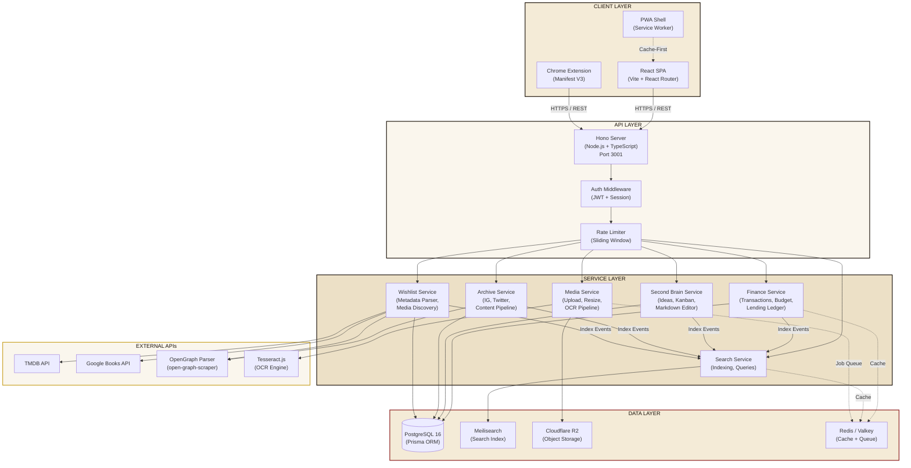
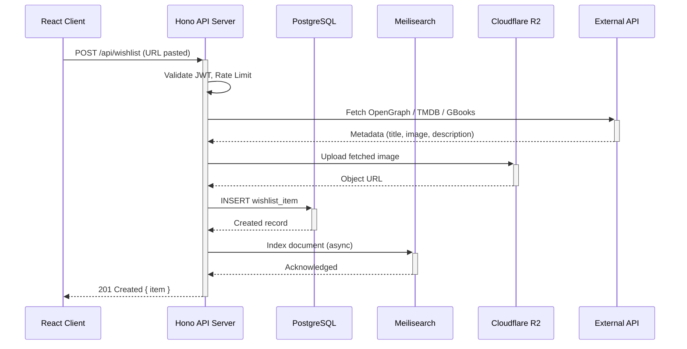
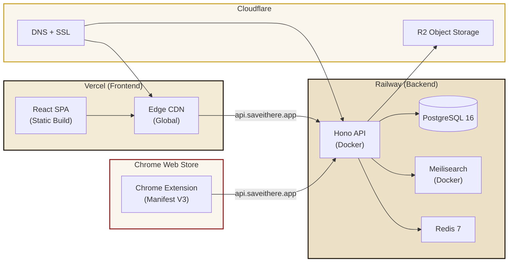
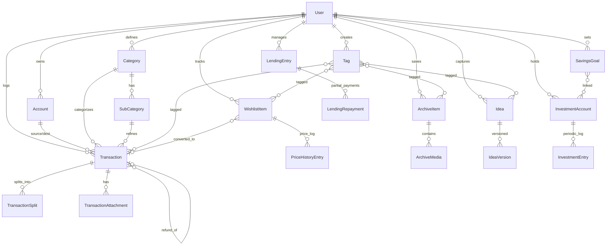
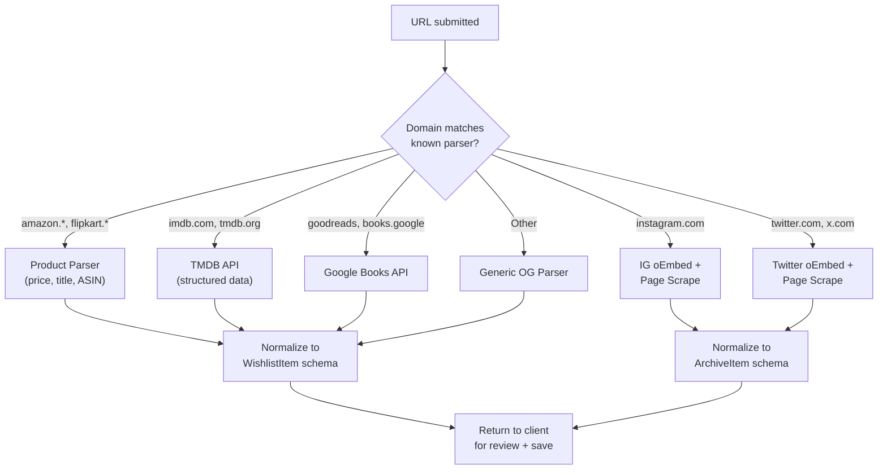
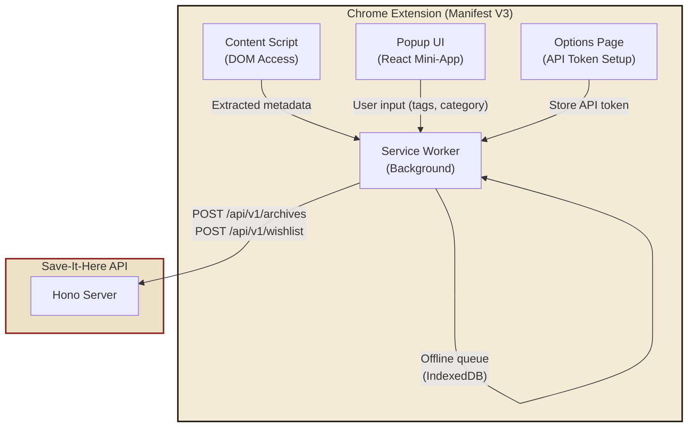
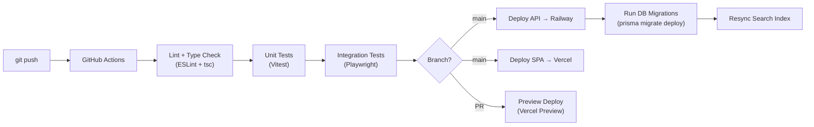

# Save-It-Here — Technical Design Document

> **Version:** 1.0 · **Date:** 2026-06-21  
> **Author:** Senior Cloud Architect & Lead Full-Stack Engineer  
> **Status:** Draft — Pending Engineering Review  
> **References:** [PRD v1.0](file:///Users/ayushhinger/.gemini/antigravity/brain/b53178d6-244e-4d61-aae7-121972e82251/prd_brd_save_it_here.md) · [UI/UX Design Document](file:///Users/ayushhinger/.gemini/antigravity/brain/b53178d6-244e-4d61-aae7-121972e82251/ui_ux_design_document.md)

---

## 1. Executive Summary

This document defines the technical architecture, infrastructure choices, data modeling, API contracts, and engineering strategy for **Save-It-Here** — a single-user, self-hostable web application that unifies personal finance management, idea capture (Second Brain), social media archiving, and a universal wishlist with media discovery.

The system is designed around three non-negotiable engineering principles:

| Principle | Implication |
|---|---|
| **Single-User Simplicity** | No multi-tenancy overhead, no complex RBAC — but security is still paramount because this is *financial data*. |
| **Sub-300ms Search** | A dedicated search engine (Meilisearch) indexes all entities for instant, typo-tolerant, cross-module search. |
| **Link Rot Resilience** | All external media is downloaded and stored locally at save-time. The system is the source of truth, not the original URL. |

---

## 2. System Architecture

### 2.1 High-Level Architecture Diagram



### 2.2 Request Flow Diagram



---

## 3. Tech Stack & Infrastructure Rationale

### 3.1 Core Stack Decisions

| Layer | Choice | Rationale |
|---|---|---|
| **Frontend Framework** | **React 19 + Vite 6** | React is mandated. Vite gives sub-second HMR, native ESM, and optimal tree-shaking. No SSR needed (single-user SPA). |
| **Styling** | **Tailwind CSS v4** | Mandated. Custom theme config maps directly to the Neo-Brutalist design tokens (`--ink`, `--paper`, `--crimson`, etc.). Tailwind v4 supports CSS-first config, eliminating `tailwind.config.js` bloat. |
| **Routing** | **React Router v7** | File-based routing with data loaders for prefetching. Keeps the SPA architecture clean. |
| **State Management** | **TanStack Query v5 + Zustand** | TanStack Query for all server state (caching, refetch, optimistic updates). Zustand for lightweight client-only state (sidebar toggle, modal stack, quick-add form). |
| **Backend Runtime** | **Node.js 22 LTS** | Mandated. Native TypeScript support via `--experimental-strip-types` (Node 22+), eliminating build step in development. |
| **Backend Framework** | **Hono** | See §3.2 below. |
| **ORM** | **Prisma ORM v6** | Mandated. Type-safe queries, auto-generated client from schema, excellent migration tooling. Prisma v6's improved query engine reduces cold-start latency. |
| **Database** | **PostgreSQL 16** | Mandated. JSONB for flexible metadata, full-text search as fallback, robust ACID compliance for financial data. |
| **Search Engine** | **Meilisearch v1.12** | See §3.3 below. |
| **Object Storage** | **Cloudflare R2** | S3-compatible, zero egress fees (critical for serving images in masonry grids), generous free tier (10 GB/month storage, 10M Class B ops). |
| **Cache / Queue** | **Redis 7 (Valkey)** | In-memory cache for dashboard aggregations, BullMQ job queue for async tasks (OCR, metadata fetching, link rot checking). |

---

### 3.2 Backend Framework: Why Hono over Express/Fastify

| Criterion | Express | Fastify | **Hono** ✅ |
|---|---|---|---|
| **Performance** | ~15K req/s | ~45K req/s | ~60K req/s (Bun); ~40K (Node) |
| **TypeScript DX** | Bolted-on types | Good TS support | Built for TS from day one. Type-safe routes, middleware, and validators via `hono/validator`. |
| **Bundle Size** | 540 KB | 2.2 MB | **14 KB** (ultra-lightweight) |
| **Middleware Ecosystem** | Vast (legacy) | Growing | Growing fast. Native CORS, JWT, rate-limit, logger, compress middlewares. |
| **Runtime Portability** | Node only | Node only | Runs on Node, Bun, Deno, Cloudflare Workers. Future-proofs the backend. |
| **Request Validation** | Needs `joi`/`zod` | Has `ajv` built in | Built-in `zod` integration via `@hono/zod-validator`. Single source of truth for request + response types. |

> [!IMPORTANT]
> **Decision:** Use **Hono** on **Node.js 22 LTS** for production stability. The option to migrate to Bun runtime for 2–3x throughput improvement is preserved as a zero-code-change migration path.

---

### 3.3 Search Engine: Why Meilisearch over Alternatives

The PRD mandates sub-300ms, typo-tolerant, cross-module search across transactions, ideas, archives, and wishlist items. Three options were evaluated:

| Criterion | PostgreSQL FTS | Typesense | **Meilisearch** ✅ |
|---|---|---|---|
| **Typo Tolerance** | ❌ None native | ✅ Built-in | ✅ Built-in (configurable edit distance) |
| **Faceted Search** | ❌ Manual SQL | ✅ Excellent | ✅ Excellent |
| **Latency (10K docs)** | ~50–200ms | ~5–20ms | ~5–15ms |
| **Latency (100K docs)** | ~200–800ms | ~10–30ms | ~10–25ms |
| **Self-Hostable** | ✅ (is the DB) | ✅ | ✅ (single binary, 50 MB) |
| **RAM Footprint** | Shared with PG | ~200 MB | ~100–150 MB |
| **Filtering** | ✅ SQL power | ✅ | ✅ |
| **Synonyms / Stop Words** | ❌ Limited | ✅ | ✅ |
| **Multi-Index Search** | ❌ Manual UNION | ✅ (v0.28+) | ✅ (`multiSearch` endpoint) |
| **Operational Complexity** | ✅ Zero (same DB) | Medium | **Low** (single binary, no config needed) |
| **Cost** | Free | Free (self-hosted) | Free (self-hosted) |

> [!TIP]
> **Decision:** Use **Meilisearch** as the primary search engine. PostgreSQL full-text search serves as a **degraded-mode fallback** if Meilisearch is temporarily unavailable. The search service abstracts this behind a common interface.

**Multi-Index Strategy:**

| Meilisearch Index | Source Entity | Indexed Fields |
|---|---|---|
| `transactions` | Expense, Income, Transfer, Lend, Borrow | amount, category, subcategory, note, tags, paymentMethod, date, merchant |
| `ideas` | Second Brain Ideas | title, content (Markdown→plaintext), tags, priority, status |
| `archives` | IG/Twitter Archives | caption, authorHandle, platform, tags, category, ocrText |
| `wishlist` | Wishlist Items | title, description, category, tags, price, status, author, genre |

---

### 3.4 Deployment Architecture



| Service | Platform | Plan | Monthly Cost (Est.) |
|---|---|---|---|
| **React SPA** | Vercel | Hobby (Free) | $0 |
| **Hono API** | Railway | Starter ($5 credit) | ~$5–10 |
| **PostgreSQL** | Railway (managed) | Included | ~$5 |
| **Meilisearch** | Railway (Docker) | Included | ~$3 |
| **Redis** | Railway (managed) | Included | ~$2 |
| **Object Storage** | Cloudflare R2 | Free tier (10 GB) | $0 |
| **DNS + SSL** | Cloudflare | Free | $0 |
| **Chrome Extension** | Chrome Web Store | One-time $5 fee | $0/mo |
| **Total** | | | **~$15–20/mo** |

> [!NOTE]
> For a fully self-hosted alternative, the entire stack runs on a single $6/mo VPS (Hetzner CX22: 2 vCPU, 4 GB RAM) using Docker Compose. A `docker-compose.yml` will be provided.

---

## 4. Database Schema Design

### 4.1 Entity Relationship Diagram



### 4.2 Core Prisma Models

> [!IMPORTANT]
> The following is a condensed representation of the key models. The full `schema.prisma` will be generated during implementation and will include all validation constraints, default values, and database-level indexes.

```prisma
// ── Accounts ──────────────────────────────

model Account {
  id            String   @id @default(cuid())
  name          String   // "HDFC Savings", "Paytm Wallet", "Cash"
  type          AccountType // BANK, CREDIT_CARD, WALLET, CASH, INVESTMENT
  balance       Decimal  @default(0) @db.Decimal(12, 2)
  currency      String   @default("INR")
  icon          String?
  color         String?
  isActive      Boolean  @default(true)
  createdAt     DateTime @default(now())
  updatedAt     DateTime @updatedAt

  transactionsFrom Transaction[] @relation("SourceAccount")
  transactionsTo   Transaction[] @relation("DestinationAccount")
}

enum AccountType {
  BANK
  CREDIT_CARD
  WALLET
  CASH
  INVESTMENT
}

// ── Transactions ──────────────────────────

model Transaction {
  id              String          @id @default(cuid())
  amount          Decimal         @db.Decimal(12, 2)
  type            TransactionType
  categoryId      String
  category        Category        @relation(fields: [categoryId], references: [id])
  subCategoryId   String?
  subCategory     SubCategory?    @relation(fields: [subCategoryId], references: [id])
  sourceAccountId String
  sourceAccount   Account         @relation("SourceAccount", fields: [sourceAccountId], references: [id])
  destAccountId   String?
  destAccount     Account?        @relation("DestinationAccount", fields: [destAccountId], references: [id])
  paymentMethod   PaymentMethod
  date            DateTime
  note            String?         @db.VarChar(280)
  isRecurring     Boolean         @default(false)
  recurrence      Recurrence?
  merchant        String?

  // Group expense fields
  isGroupExpense  Boolean         @default(false)
  myShare         Decimal?        @db.Decimal(12, 2)

  // Refund linkage
  refundOfId      String?
  refundOf        Transaction?    @relation("RefundLink", fields: [refundOfId], references: [id])
  refunds         Transaction[]   @relation("RefundLink")
  refundType      RefundType?

  // Relations
  splits          TransactionSplit[]
  attachments     TransactionAttachment[]
  tags            Tag[]
  lendingEntries  LendingEntry[]

  createdAt       DateTime        @default(now())
  updatedAt       DateTime        @updatedAt

  @@index([date])
  @@index([type])
  @@index([categoryId])
  @@index([sourceAccountId])
}

enum TransactionType {
  EXPENSE
  INCOME
  TRANSFER
  LEND
  BORROW
  LEND_REPAYMENT
  BORROW_REPAYMENT
  GROUP_EXPENSE
}

enum PaymentMethod {
  UPI
  CASH
  CREDIT_CARD
  DEBIT_CARD
  NET_BANKING
  WALLET
  AUTO_DEBIT
}

enum Recurrence {
  NONE
  DAILY
  WEEKLY
  MONTHLY
  YEARLY
}

enum RefundType {
  FULL_REFUND
  PARTIAL_REFUND
}

// ── Categories ────────────────────────────

model Category {
  id            String        @id @default(cuid())
  name          String
  icon          String?
  budgetAmount  Decimal?      @db.Decimal(12, 2) // Monthly budget
  sortOrder     Int           @default(0)
  isSystem      Boolean       @default(false) // e.g., "Transfers" can't be deleted

  subCategories SubCategory[]
  transactions  Transaction[]

  @@unique([name])
}

model SubCategory {
  id           String        @id @default(cuid())
  name         String
  categoryId   String
  category     Category      @relation(fields: [categoryId], references: [id], onDelete: Cascade)
  sortOrder    Int           @default(0)
  transactions Transaction[]

  @@unique([categoryId, name])
}

// ── Lending Ledger ────────────────────────

model LendingEntry {
  id              String   @id @default(cuid())
  personName      String
  type            LendType // LEND or BORROW
  principalAmount Decimal  @db.Decimal(12, 2)
  outstandingAmount Decimal @db.Decimal(12, 2)
  interestRate    Decimal? @db.Decimal(5, 2) // Annual %
  status          LendStatus @default(ACTIVE)
  transactionId   String   // Original transaction
  transaction     Transaction @relation(fields: [transactionId], references: [id])
  dueDate         DateTime?
  note            String?

  repayments      LendingRepayment[]

  createdAt       DateTime @default(now())
  updatedAt       DateTime @updatedAt

  @@index([personName])
  @@index([status])
}

enum LendType { LEND BORROW }
enum LendStatus { ACTIVE PARTIAL_DUE SETTLED OVERDUE }

model LendingRepayment {
  id             String       @id @default(cuid())
  lendingEntryId String
  lendingEntry   LendingEntry @relation(fields: [lendingEntryId], references: [id])
  amount         Decimal      @db.Decimal(12, 2)
  accountId      String       // Receiving account
  date           DateTime
  note           String?
  createdAt      DateTime     @default(now())
}

// ── Ideas (Second Brain) ──────────────────

model Idea {
  id          String     @id @default(cuid())
  title       String
  content     String     @db.Text // Markdown
  status      IdeaStatus @default(SPARK)
  priority    Priority   @default(MEDIUM)
  kanbanOrder Int        @default(0)
  tags        Tag[]
  versions    IdeaVersion[]

  createdAt   DateTime   @default(now())
  updatedAt   DateTime   @updatedAt

  @@index([status])
  @@index([priority])
}

enum IdeaStatus { SPARK EXPLORING IN_PROGRESS DONE ARCHIVED }
enum Priority { LOW MEDIUM HIGH CRITICAL }

model IdeaVersion {
  id        String   @id @default(cuid())
  ideaId    String
  idea      Idea     @relation(fields: [ideaId], references: [id], onDelete: Cascade)
  content   String   @db.Text
  createdAt DateTime @default(now())
}

// ── Social Archives ───────────────────────

model ArchiveItem {
  id             String        @id @default(cuid())
  platform       Platform
  contentType    ContentType
  originalUrl    String?
  authorHandle   String?
  authorName     String?
  caption        String?       @db.Text
  postDate       DateTime?
  ocrText        String?       @db.Text // Extracted text from images
  ocrConfidence  Float?
  linkStatus     LinkStatus    @default(ALIVE)
  userCategory   String?       // User-defined: "Recipes", "Tech Threads", etc.
  tags           Tag[]
  media          ArchiveMedia[]
  note           String?       @db.Text

  createdAt      DateTime      @default(now())
  updatedAt      DateTime      @updatedAt

  @@index([platform])
  @@index([linkStatus])
  @@index([userCategory])
}

enum Platform { INSTAGRAM TWITTER GENERIC }
enum ContentType { IMAGE CAROUSEL REEL VIDEO THREAD TEXT }
enum LinkStatus { ALIVE DEAD UNKNOWN }

model ArchiveMedia {
  id            String      @id @default(cuid())
  archiveItemId String
  archiveItem   ArchiveItem @relation(fields: [archiveItemId], references: [id], onDelete: Cascade)
  type          MediaType   // IMAGE, VIDEO, THUMBNAIL
  storageKey    String      // R2 object key
  storageUrl    String      // Public R2 URL
  width         Int?
  height        Int?
  sizeBytes     Int?
  mimeType      String?
  sortOrder     Int         @default(0)
}

enum MediaType { IMAGE VIDEO THUMBNAIL SCREENSHOT }

// ── Wishlist ──────────────────────────────

model WishlistItem {
  id            String         @id @default(cuid())
  title         String
  category      WishlistCategory
  url           String?
  imageUrl      String?
  imageStorageKey String?      // Local R2 copy
  description   String?        @db.Text
  price         Decimal?       @db.Decimal(12, 2)
  currency      String         @default("INR")
  priority      Priority       @default(MEDIUM)
  status        WishlistStatus @default(SAVED)
  notes         String?        @db.Text
  personalRating Int?          // 1–10
  review        String?        @db.Text

  // Category-specific metadata (JSONB)
  metadata      Json?          @db.JsonB

  // External IDs for dedup
  tmdbId        Int?
  isbn          String?
  asin          String?

  // Conversion to expense
  convertedTransactionId String? @unique

  tags          Tag[]
  priceHistory  PriceHistoryEntry[]

  createdAt     DateTime       @default(now())
  updatedAt     DateTime       @updatedAt

  @@index([category])
  @@index([status])
  @@index([tmdbId])
  @@index([isbn])
}

enum WishlistCategory {
  WEBSITE
  INSTAGRAM_PAGE
  CONSUMER_GOOD
  BOOK
  MOVIE
  TV_SHOW
  MUSIC
  COURSE
  PLACE
  CUSTOM
}

enum WishlistStatus {
  SAVED
  CONSIDERING
  PLANNED
  PURCHASED
  CONSUMED
  ABANDONED
}

model PriceHistoryEntry {
  id             String       @id @default(cuid())
  wishlistItemId String
  wishlistItem   WishlistItem @relation(fields: [wishlistItemId], references: [id], onDelete: Cascade)
  price          Decimal      @db.Decimal(12, 2)
  sourceUrl      String?
  recordedAt     DateTime     @default(now())
}

// ── Tags (Global) ─────────────────────────

model Tag {
  id            String         @id @default(cuid())
  name          String         @unique
  color         String?        // Optional display color
  transactions  Transaction[]
  ideas         Idea[]
  archiveItems  ArchiveItem[]
  wishlistItems WishlistItem[]
  createdAt     DateTime       @default(now())
}

// ── Investments ───────────────────────────

model InvestmentAccount {
  id            String   @id @default(cuid())
  name          String   // "HDFC MF - Flexi Cap"
  type          InvestmentType
  institution   String?  // AMC, Bank, Fund Manager
  accountNumber String?  // Folio, Account No
  currentValue  Decimal  @default(0) @db.Decimal(14, 2)
  metadata      Json?    @db.JsonB // Type-specific fields

  entries       InvestmentEntry[]
  savingsGoals  SavingsGoal[]

  createdAt     DateTime @default(now())
  updatedAt     DateTime @updatedAt
}

enum InvestmentType {
  MUTUAL_FUND_SIP
  PROVIDENT_FUND
  NPS
  FIXED_DEPOSIT
  STOCKS
  CRYPTO
  GOLD
  OTHER
}

model InvestmentEntry {
  id                  String            @id @default(cuid())
  investmentAccountId String
  investmentAccount   InvestmentAccount  @relation(fields: [investmentAccountId], references: [id])
  type                InvestmentEntryType // CONTRIBUTION, WITHDRAWAL, VALUATION
  amount              Decimal            @db.Decimal(14, 2)
  date                DateTime
  note                String?
  createdAt           DateTime           @default(now())
}

enum InvestmentEntryType { CONTRIBUTION WITHDRAWAL VALUATION }

model SavingsGoal {
  id            String   @id @default(cuid())
  name          String   // "Emergency Fund"
  targetAmount  Decimal  @db.Decimal(14, 2)
  currentAmount Decimal  @default(0) @db.Decimal(14, 2)
  deadline      DateTime?
  linkedAccounts InvestmentAccount[]
  createdAt     DateTime @default(now())
  updatedAt     DateTime @updatedAt
}
```

### 4.3 Key Schema Design Decisions

| Decision | Rationale |
|---|---|
| **`cuid()` for primary keys** | Collision-resistant, sortable, URL-safe. Avoids the predictability of sequential integers (security) and the index fragmentation of UUIDs v4. |
| **`Decimal(12,2)` for currency** | Avoids floating-point rounding errors. 12 digits supports amounts up to ₹99,99,99,99,999.99. |
| **JSONB for `metadata`** | Wishlist items and investments have type-specific fields (TMDB data, book details, SIP data). JSONB avoids schema explosion while still being queryable and indexable in PostgreSQL. |
| **Self-referential `refundOf`** | Refunds link back to original transactions, preserving audit trail without duplicating data. |
| **Many-to-many tags via implicit relations** | Prisma's implicit M2M creates join tables automatically. The `Tag` entity is shared across all modules, enabling cross-module tag search. |
| **Separate `ArchiveMedia` model** | Supports carousels (multiple images per IG post) and thread stitching (multiple tweets). Stored media tracks both the R2 key and the public URL. |

---

## 5. API Design

### 5.1 API Philosophy

| Aspect | Decision |
|---|---|
| **Style** | RESTful with JSON payloads. GraphQL rejected — adds unnecessary complexity for a single-user app with well-defined, module-specific views. |
| **Versioning** | URL-prefixed: `/api/v1/...`. Enables future breaking changes without disrupting the Chrome Extension. |
| **Authentication** | JWT Bearer tokens (short-lived, 15 min) + HTTP-only Refresh tokens (7 days). Single-user PIN/password login. |
| **Validation** | Zod schemas shared between API and client (via a `@save-it-here/shared` package in a monorepo). |
| **Error Format** | RFC 7807 Problem Details: `{ type, title, status, detail, instance }`. |
| **Pagination** | Cursor-based (Prisma's `cursor` + `take`). Offset pagination for legacy views. |

### 5.2 Endpoint Inventory

#### Finance Module

| Method | Endpoint | Description |
|---|---|---|
| `POST` | `/api/v1/transactions` | Create transaction (expense, income, transfer, lend, borrow, group) |
| `GET` | `/api/v1/transactions` | List with filters (`?type=EXPENSE&category=food&from=2026-06-01&to=2026-06-30&page=1`) |
| `GET` | `/api/v1/transactions/:id` | Get single transaction with splits, attachments, refunds |
| `PUT` | `/api/v1/transactions/:id` | Update transaction |
| `DELETE` | `/api/v1/transactions/:id` | Soft-delete (marks `deletedAt`) |
| `POST` | `/api/v1/transactions/:id/split` | Create split entries for a transaction |
| `POST` | `/api/v1/transactions/:id/refund` | Create a refund linked to original transaction |
| `GET` | `/api/v1/accounts` | List all accounts with balances |
| `POST` | `/api/v1/accounts` | Create account |
| `PUT` | `/api/v1/accounts/:id` | Update account |
| `GET` | `/api/v1/categories` | List category tree with budget allocations |
| `PUT` | `/api/v1/categories/:id/budget` | Set monthly budget for category |
| `GET` | `/api/v1/dashboard/financial` | Aggregated dashboard: budget gauge, category breakdown, daily trend, MoM comparison, insights |
| `GET` | `/api/v1/lending` | Lending ledger: all active/settled entries |
| `POST` | `/api/v1/lending/:id/repayment` | Log a partial/full repayment |
| `GET` | `/api/v1/investments` | List investment accounts with current values |
| `POST` | `/api/v1/investments` | Create investment account |
| `POST` | `/api/v1/investments/:id/entries` | Log contribution, withdrawal, or valuation |
| `GET` | `/api/v1/savings-goals` | List savings goals with progress |

#### Second Brain Module

| Method | Endpoint | Description |
|---|---|---|
| `POST` | `/api/v1/ideas` | Create idea |
| `GET` | `/api/v1/ideas` | List with filters (`?status=SPARK&priority=HIGH&tags=startup`) |
| `GET` | `/api/v1/ideas/:id` | Get idea with version history |
| `PUT` | `/api/v1/ideas/:id` | Update idea content/metadata |
| `PATCH` | `/api/v1/ideas/:id/status` | Move idea between Kanban columns |
| `PATCH` | `/api/v1/ideas/:id/reorder` | Update Kanban order within column |
| `GET` | `/api/v1/ideas/:id/versions` | List version snapshots |
| `GET` | `/api/v1/ideas/:id/versions/:versionId` | Get specific version (for diff) |

#### Archive Module

| Method | Endpoint | Description |
|---|---|---|
| `POST` | `/api/v1/archives` | Create archive item (URL or file upload) |
| `GET` | `/api/v1/archives` | List with filters (`?platform=INSTAGRAM&tags=recipe&category=cooking`) |
| `GET` | `/api/v1/archives/:id` | Get item with all media |
| `PUT` | `/api/v1/archives/:id` | Update tags, category, notes |
| `DELETE` | `/api/v1/archives/:id` | Delete (also removes R2 objects) |
| `POST` | `/api/v1/archives/bulk` | Bulk tag / categorize / delete |
| `POST` | `/api/v1/archives/:id/check-link` | Manually trigger link rot check |

#### Wishlist Module

| Method | Endpoint | Description |
|---|---|---|
| `POST` | `/api/v1/wishlist` | Create item (with auto-metadata fetch) |
| `GET` | `/api/v1/wishlist` | List with filters |
| `GET` | `/api/v1/wishlist/:id` | Get item with price history |
| `PUT` | `/api/v1/wishlist/:id` | Update item |
| `PATCH` | `/api/v1/wishlist/:id/status` | Update status (SAVED → PURCHASED, etc.) |
| `POST` | `/api/v1/wishlist/:id/price` | Log manual price update |
| `POST` | `/api/v1/wishlist/:id/convert` | Convert to expense transaction |
| `GET` | `/api/v1/wishlist/check-duplicate` | Check for duplicate before save (`?url=...&title=...`) |

#### Media Discovery

| Method | Endpoint | Description |
|---|---|---|
| `GET` | `/api/v1/discover/movies` | Search TMDB movies (`?q=inception&genre=28&year=2010`) |
| `GET` | `/api/v1/discover/tv` | Search TMDB TV shows |
| `GET` | `/api/v1/discover/books` | Search Google Books (`?q=sapiens&author=harari`) |
| `GET` | `/api/v1/discover/trending` | Trending movies + TV shows from TMDB |

#### Global Search

| Method | Endpoint | Description |
|---|---|---|
| `GET` | `/api/v1/search` | Unified search (`?q=sushi&module=expense,wishlist&tags=food`) |
| `GET` | `/api/v1/search/suggest` | Typeahead suggestions (top 5 matches) |

#### Metadata & Utility

| Method | Endpoint | Description |
|---|---|---|
| `POST` | `/api/v1/metadata/parse-url` | Fetch OpenGraph/domain-specific metadata for a URL |
| `GET` | `/api/v1/tags` | List all tags with usage counts |
| `PUT` | `/api/v1/tags/:id` | Rename tag (propagates) |
| `POST` | `/api/v1/tags/merge` | Merge two tags |
| `POST` | `/api/v1/export/:module` | Export data as JSON or CSV |
| `POST` | `/api/v1/auth/login` | Login with PIN/password |
| `POST` | `/api/v1/auth/refresh` | Refresh JWT token |
| `POST` | `/api/v1/auth/logout` | Invalidate refresh token |

### 5.3 Unified Search Implementation

The search endpoint (`GET /api/v1/search`) uses Meilisearch's `multiSearch` to query all four indexes in a single request:

```typescript
// search.service.ts
import { MeiliSearch } from 'meilisearch';

interface SearchParams {
  q: string;
  modules?: ('transactions' | 'ideas' | 'archives' | 'wishlist')[];
  tags?: string[];
  limit?: number;
}

async function globalSearch(params: SearchParams) {
  const client = new MeiliSearch({ host: 'http://meilisearch:7700' });

  const targetIndexes = params.modules ?? ['transactions', 'ideas', 'archives', 'wishlist'];

  const queries = targetIndexes.map(index => ({
    indexUid: index,
    q: params.q,
    limit: params.limit ?? 10,
    filter: params.tags?.length
      ? `tags IN [${params.tags.map(t => `"${t}"`).join(', ')}]`
      : undefined,
    attributesToHighlight: ['title', 'content', 'caption', 'note', 'description'],
    highlightPreTag: '<mark>',
    highlightPostTag: '</mark>',
  }));

  const results = await client.multiSearch({ queries });

  // Merge, rank by score, and return grouped results
  return {
    results: results.results.map(r => ({
      module: r.indexUid,
      hits: r.hits,
      estimatedTotalHits: r.estimatedTotalHits,
      processingTimeMs: r.processingTimeMs,
    })),
    totalProcessingTimeMs: results.results.reduce(
      (sum, r) => sum + r.processingTimeMs, 0
    ),
  };
}
```

**Advanced Query Syntax** is parsed on the backend before being translated to Meilisearch filters:

```
Input:  "module:expense amount:>500 tag:travel sushi restaurant"
Parsed: {
  modules: ['transactions'],
  filters: ['amount > 500'],
  tags: ['travel'],
  freeText: 'sushi restaurant'
}
```

---

## 6. Third-Party Integrations & Scraping Strategy

### 6.1 OpenGraph Metadata Fetching



**Implementation:**

```typescript
// metadata-parser.service.ts
import ogs from 'open-graph-scraper';

const DOMAIN_PARSERS: Record<string, (url: string) => Promise<Metadata>> = {
  'amazon': parseAmazonProduct,
  'flipkart': parseFlipkartProduct,
  'instagram': parseInstagramContent,
  'twitter': parseTwitterContent,
  'x.com': parseTwitterContent,
};

async function parseUrl(url: string): Promise<Metadata> {
  const domain = new URL(url).hostname.replace('www.', '');

  // 1. Try domain-specific parser
  for (const [key, parser] of Object.entries(DOMAIN_PARSERS)) {
    if (domain.includes(key)) {
      return parser(url);
    }
  }

  // 2. Fallback to OpenGraph
  const { result } = await ogs({
    url,
    timeout: 8000,
    headers: {
      'User-Agent': 'Mozilla/5.0 (compatible; SaveItHereBot/1.0)',
    },
  });

  return {
    title: result.ogTitle ?? result.twitterTitle ?? '',
    description: result.ogDescription ?? result.twitterDescription ?? '',
    image: result.ogImage?.[0]?.url ?? result.twitterImage?.[0]?.url ?? null,
    siteName: result.ogSiteName ?? domain,
    type: result.ogType ?? 'website',
  };
}
```

### 6.2 Social Media Archiving Strategy

> [!WARNING]
> Instagram and Twitter official APIs are increasingly restricted. The strategy below uses a layered fallback approach that prioritizes official endpoints but degrades gracefully.

| Layer | Method | Reliability | Rate Limits |
|---|---|---|---|
| **1. oEmbed (Primary)** | `https://api.instagram.com/oembed/?url=...` / Twitter oEmbed | High (official) | 500 req/hr (IG), Generous (Twitter) |
| **2. Page Meta Scrape** | Fetch the public page HTML, extract `<meta og:*>` tags | Medium (depends on rendering) | Self-limited (2 req/sec) |
| **3. Chrome Extension Capture** | The extension has DOM access on the active page — extract directly from the rendered DOM | High (user-initiated) | N/A (user action) |
| **4. Manual Upload** | User uploads screenshot/image + fills metadata manually | Guaranteed | N/A |

**Chrome Extension as Primary Archiver:**

The Chrome Extension is the most reliable archival mechanism because it executes in the context of the user's authenticated browser session:

```javascript
// content-script.js (runs on instagram.com/p/*)
function extractInstagramPost() {
  const article = document.querySelector('article');
  const images = Array.from(article?.querySelectorAll('img[src*="instagram"]') ?? []);
  const caption = article?.querySelector('[class*="Caption"]')?.textContent;
  const author = document.querySelector('header a')?.textContent;

  return {
    platform: 'INSTAGRAM',
    contentType: images.length > 1 ? 'CAROUSEL' : 'IMAGE',
    images: images.map(img => img.src),
    caption,
    authorHandle: author,
    originalUrl: window.location.href,
    postDate: document.querySelector('time')?.dateTime,
  };
}
```

### 6.3 Media Discovery APIs

| API | Authentication | Rate Limits | Caching Strategy |
|---|---|---|---|
| **TMDB** | API Key (v3) or Bearer Token (v4) | 40 req/10s | Cache search results for 1 hour. Cache movie/TV details for 24 hours. |
| **Google Books** | API Key | 1000 req/day | Cache search results for 1 hour. Cache volume details for 7 days. |

---

## 7. Security Architecture

### 7.1 Threat Model (Single-User Context)

| Threat | Mitigation |
|---|---|
| **Unauthorized access** | PIN/password login → JWT. Optional WebAuthn for biometric. No password recovery (single-user; manual DB reset). |
| **Token theft** | Access tokens: 15 min expiry, stored in memory (not localStorage). Refresh tokens: 7-day expiry, HTTP-only cookie, `SameSite=Strict`. |
| **Data exfiltration** | HTTPS enforced (Cloudflare SSL). PostgreSQL at-rest encryption via `pgcrypto` for sensitive fields (account numbers, folio numbers). |
| **SQL injection** | Prisma's parameterized queries eliminate SQL injection vectors. |
| **XSS** | React's default JSX escaping. Content Security Policy headers. DOMPurify for rendering user Markdown. |
| **CSRF** | SameSite cookies + CSRF token for state-changing requests. |
| **Brute force** | Rate limiting: 5 login attempts per minute. Exponential backoff on failure. |
| **Supply chain** | `npm audit` in CI. Lock file integrity checks. Minimal dependency surface. |

### 7.2 Encryption Strategy

```
┌──────────────────────────────────────────────────┐
│  TRANSPORT: TLS 1.3 (Cloudflare → Railway)       │
├──────────────────────────────────────────────────┤
│  APPLICATION: Sensitive fields encrypted with     │
│  AES-256-GCM via pgcrypto before storage:        │
│    • account.accountNumber                        │
│    • investment.folioNumber                       │
│    • user.passwordHash (bcrypt, 12 rounds)        │
├──────────────────────────────────────────────────┤
│  STORAGE: PostgreSQL (Railway managed)            │
│    • Encrypted volumes at rest                    │
│    • Automated daily backups (7-day retention)    │
├──────────────────────────────────────────────────┤
│  OBJECTS: Cloudflare R2                           │
│    • Server-side encryption (SSE-S3)              │
│    • Private bucket; signed URLs for access       │
└──────────────────────────────────────────────────┘
```

### 7.3 API Security Headers

```typescript
// security.middleware.ts (Hono)
app.use('*', secureHeaders({
  contentSecurityPolicy: {
    defaultSrc: ["'self'"],
    scriptSrc: ["'self'"],
    styleSrc: ["'self'", "'unsafe-inline'", "https://fonts.googleapis.com"],
    imgSrc: ["'self'", "data:", "https://*.r2.cloudflarestorage.com", "https://image.tmdb.org"],
    fontSrc: ["'self'", "https://fonts.gstatic.com"],
    connectSrc: ["'self'", "https://api.themoviedb.org", "https://www.googleapis.com"],
  },
  xFrameOptions: 'DENY',
  xContentTypeOptions: 'nosniff',
  referrerPolicy: 'strict-origin-when-cross-origin',
  strictTransportSecurity: 'max-age=31536000; includeSubDomains',
}));
```

---

## 8. Performance Engineering

### 8.1 Search Performance (Sub-300ms Target)

| Optimization | Implementation |
|---|---|
| **Meilisearch in-memory index** | All indices fit in RAM for datasets up to ~500K documents. Single-user app will have ~10K–50K docs. Expected latency: **5–20ms**. |
| **Typeahead debouncing** | Client debounces search input at 250ms. Only the latest request is processed (abort controller cancels in-flight requests). |
| **Search result caching** | Redis caches the top 100 most frequent queries for 5 minutes. Cache is busted on write operations. |
| **Attribute ranking** | Meilisearch ranking rules: `["words", "typo", "proximity", "attribute", "sort", "exactness"]`. Title matches rank higher than description matches. |

### 8.2 Image Performance (Masonry Grid)

| Optimization | Implementation |
|---|---|
| **Responsive image variants** | On upload, generate 3 variants via `sharp`: thumb (200px), medium (600px), full (original). Store all in R2. |
| **Modern formats** | Convert all images to WebP (lossy, quality 80). AVIF as progressive enhancement for supporting browsers. |
| **Lazy loading** | `loading="lazy"` + Intersection Observer for below-fold images. |
| **Blur hash placeholders** | Generate BlurHash strings on upload. Display as CSS background while actual image loads. |
| **CDN caching** | Cloudflare R2 objects served via Cloudflare CDN with `Cache-Control: public, max-age=31536000, immutable` (content-addressed filenames). |
| **Virtual scrolling** | For masonry grids with 100+ items, use `react-virtuoso` or `@tanstack/virtual` to only render visible cards. |

### 8.3 Dashboard Aggregation Performance

Financial dashboard queries (budget gauge, category breakdown, daily trend, MoM comparison) are inherently expensive SQL aggregations. Strategy:

| Approach | Implementation |
|---|---|
| **Materialized aggregation cache** | Redis stores pre-computed dashboard data. Key: `dashboard:financial:2026-06`. TTL: 5 minutes. |
| **Cache invalidation** | Any transaction CRUD operation invalidates the affected month's cache key. |
| **PostgreSQL partial indexes** | `CREATE INDEX idx_txn_month ON transaction (date) WHERE type IN ('EXPENSE', 'INCOME')` — speeds up monthly aggregations. |
| **Background refresh** | A BullMQ job recalculates dashboard aggregations every 5 minutes and warms the Redis cache. |

---

## 9. Chrome Extension Architecture



**Key Design Decisions:**

| Aspect | Decision |
|---|---|
| **Manifest Version** | V3 (required for Chrome Web Store). Service Worker replaces persistent background page. |
| **Authentication** | User copies an API token from the web app's Settings page and pastes it into the extension's Options page. Token stored in `chrome.storage.local` (encrypted by Chrome). |
| **Offline Queue** | If the API is unreachable, saves are queued in IndexedDB. The service worker retries on `navigator.onLine` events with exponential backoff. |
| **Content Scripts** | Injected only on matching URLs (`instagram.com`, `twitter.com`, `x.com`, `amazon.*`, `flipkart.*`). Extracts DOM data without requiring broad permissions. |
| **Permissions** | Minimal: `activeTab`, `storage`, `contextMenus`. No `<all_urls>` — the popup triggers metadata extraction on demand. |

---

## 10. Monorepo Structure

```
save-it-here/
├── apps/
│   ├── web/                      # React SPA (Vite)
│   │   ├── src/
│   │   │   ├── components/       # Shared UI components
│   │   │   ├── features/         # Feature modules
│   │   │   │   ├── finance/
│   │   │   │   ├── brain/
│   │   │   │   ├── archive/
│   │   │   │   ├── wishlist/
│   │   │   │   └── search/
│   │   │   ├── hooks/
│   │   │   ├── lib/              # API client, utils
│   │   │   └── styles/           # Tailwind + Neo-Brutalist tokens
│   │   ├── index.html
│   │   ├── vite.config.ts
│   │   └── tailwind.config.ts
│   │
│   ├── api/                      # Hono API Server
│   │   ├── src/
│   │   │   ├── routes/           # Route handlers per module
│   │   │   ├── services/         # Business logic
│   │   │   ├── middleware/       # Auth, rate-limit, error handler
│   │   │   ├── jobs/             # BullMQ job processors
│   │   │   ├── integrations/     # TMDB, Google Books, OG parsers
│   │   │   └── lib/              # DB client, search client, R2 client
│   │   ├── prisma/
│   │   │   ├── schema.prisma
│   │   │   ├── migrations/
│   │   │   └── seed.ts
│   │   └── Dockerfile
│   │
│   └── extension/                # Chrome Extension
│       ├── manifest.json
│       ├── src/
│       │   ├── background/       # Service worker
│       │   ├── content/          # Content scripts
│       │   ├── popup/            # Popup React mini-app
│       │   └── options/          # Options page
│       └── webpack.config.js
│
├── packages/
│   └── shared/                   # Shared types, Zod schemas, constants
│       ├── src/
│       │   ├── schemas/          # Zod validation schemas
│       │   ├── types/            # TypeScript interfaces
│       │   └── constants/        # Enums, category defaults
│       └── package.json
│
├── docker-compose.yml            # Local dev: PG + Meilisearch + Redis
├── docker-compose.prod.yml       # Self-hosted production
├── turbo.json                    # Turborepo config
├── package.json                  # Root workspace
└── README.md
```

---

## 11. Monitoring & Observability

| Concern | Tool | Implementation |
|---|---|---|
| **API Metrics** | Hono + `prom-client` | Request count, latency percentiles (p50/p95/p99), error rate per route. Exposed at `/metrics`. |
| **Error Tracking** | Sentry (free tier) | Unhandled exceptions, Prisma query failures, external API errors. Source maps uploaded at build time. |
| **Uptime Monitoring** | Uptime Kuma (self-hosted) | Health check endpoint: `GET /api/v1/health` checks PG, Meilisearch, and Redis connectivity. Alerts via Telegram/Email. |
| **Structured Logging** | Pino (JSON logs) | Correlation IDs per request. Log rotation via Docker log driver. |
| **Database Monitoring** | `pg_stat_statements` | Track slow queries (>100ms). Monthly vacuum/analyze schedule. |
| **Search Health** | Meilisearch `/health` + `/stats` | Index size, document count, last index update timestamp. |

### Health Check Endpoint

```typescript
app.get('/api/v1/health', async (c) => {
  const checks = {
    database: await checkPostgres(),
    search: await checkMeilisearch(),
    cache: await checkRedis(),
    storage: await checkR2(),
  };

  const allHealthy = Object.values(checks).every(c => c.status === 'ok');

  return c.json({
    status: allHealthy ? 'healthy' : 'degraded',
    checks,
    uptime: process.uptime(),
    timestamp: new Date().toISOString(),
  }, allHealthy ? 200 : 503);
});
```

---

## 12. Disaster Recovery & Data Export

| Scenario | Strategy |
|---|---|
| **Database failure** | Railway automated daily backups (7-day retention). Manual backup via `pg_dump` cron job to R2 (daily, 30-day retention). |
| **Search index corruption** | Meilisearch index is ephemeral — rebuilt from PostgreSQL via a `resync-search` CLI command that reads all entities and re-indexes. |
| **R2 data loss** | Images are immutable post-upload. Monthly R2 backup to a secondary bucket or local archive. |
| **Full data export** | `POST /api/v1/export/:module` generates JSON/CSV per module. `POST /api/v1/export/all` creates a full ZIP archive with all data + media. |
| **Self-hosted migration** | `docker-compose.prod.yml` + `pg_restore` enables full migration to any VPS in under 30 minutes. |

---

## 13. Development & CI/CD Pipeline



| Stage | Tool | Config |
|---|---|---|
| **Package Manager** | pnpm 9 | Workspace protocol, strict peer deps |
| **Monorepo Orchestrator** | Turborepo | Parallel builds, remote caching |
| **Lint** | ESLint 9 (flat config) + Prettier | Shared config in `packages/shared` |
| **Unit Tests** | Vitest | Service-layer tests with Prisma mock client |
| **E2E Tests** | Playwright | Critical flows: login, quick-add, search, wishlist save |
| **API Deploy** | Railway (auto from `main`) | Dockerfile build, health check gate |
| **SPA Deploy** | Vercel (auto from `main`) | Zero-config Vite project detection |

---

> [!IMPORTANT]
> ## Open Questions for Review
>
> 1. **WebAuthn / Biometric Auth:** Should we implement WebAuthn (passkey) login for mobile from v1, or is PIN/password sufficient for launch? WebAuthn adds ~2 days of implementation.
>
> 2. **OCR Engine Placement:** Should Tesseract.js run client-side (in the browser via Web Worker) or server-side (Node.js)? Client-side offloads server CPU but increases initial bundle size (~2 MB WASM). Server-side is simpler but consumes API server resources.
>
> 3. **Real-Time Dashboard:** Should the financial dashboard update in real-time (WebSocket push on new transaction) or is polling every 30 seconds acceptable? WebSocket adds infrastructure complexity.
>
> 4. **Self-Hosted Priority:** Should the `docker-compose.prod.yml` self-hosted path be a v1 deliverable, or is Railway-hosted sufficient for launch?
